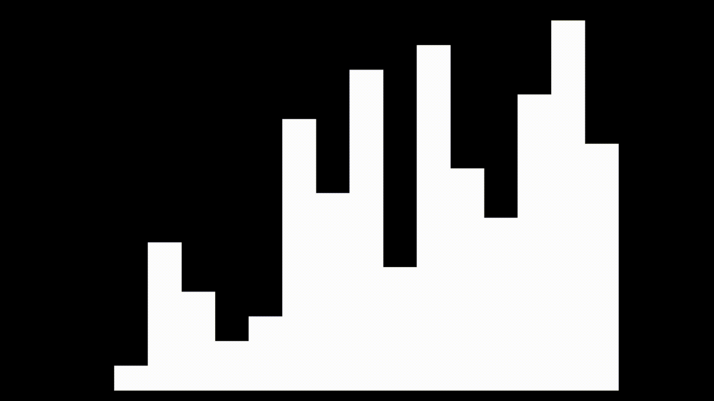

# Visualising Sorting Algorithm

The following program is my implementation of visualising sorting algorithms. This was inspired by sorting algorithms seen in YouTube videos.

## Demonstration


## Required libraries
* pygame 
```
pip3 install pygame
```

## Usage
<p> To start the program, open the terminal in the folder and type </p>

```
python3 main.py
```

<p>This will run the program with the default number of elements (default = 15) and the default speed of comparisons (default = 200ms)</p>
<p>To change the default parameters run the following command</p>

```
python3 main.py -elem 20 -spd 50
```

<p>This will run he program with 20 elements and the comparison speed would be 50ms</p>

* To suffle the array, press the "r" key
* To use selection sort, press the "1" key
* To use insertion sort, press the "2" key
* To use quick sort, press the "3" key
* To use bubble sort, press the "4" key
* To use merge sort, press the "5" key

Do note that numbers on the number pad doesn't work.