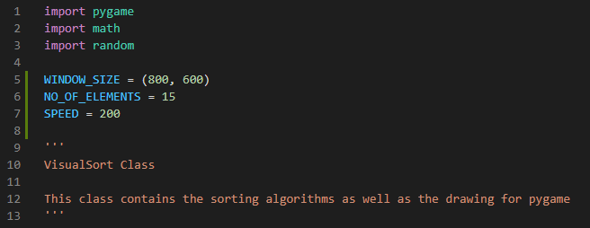

# Visualising Sorting Algorithm

The following program is my implementation of visualising sorting algorithms. This was inspired my sorting algorithms seen in YouTube videos.

## Demonstration


## Required libraries
* python3
* pygame 
```
pip3 install pygame
```

## Parameters
Parameters that can be changed is at line 5-8

Parameters | Description | Default value 
--- | --- | --- 
WINDOW_SIZE | Size of the displayed window | (800, 600)
NO_OF_ELEM | Number of elements to be sorted | 15
SPEED | Speed of comparisons (in milliseconds) | 200

## Usage
* To suffle the array, press the "0" key
* To use selection sort, press the "1" key
* To use insertion sort, press the "2" key
* To use quick sort, press the "3" key
* To use bubble sort, press the "4" key
* To use merge sort, press the "5" key

Do note that numbers on the number pad doesn't work.